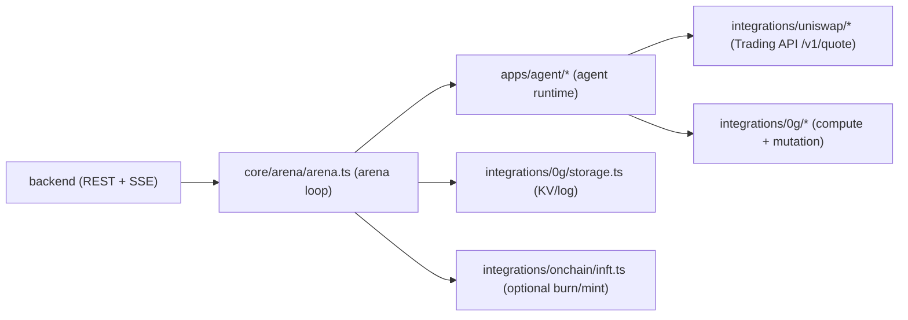
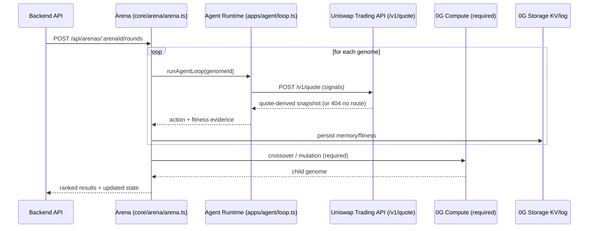

# Cambrian

Darwin-style on-chain agent evolution scaffold (off-chain runtime + API).

This repo intentionally focuses on the off-chain system loop:

- `apps/` for runnable services
- `core/` for Darwin domain logic (genomes, arena lifecycle, evolution)
- `integrations/` for external boundaries
- `scripts/` for local operator workflows
- `config/` for environment and network setup
- `backend/` for a minimal HTTP API to drive the arena

Smart contracts and frontend are out of scope in this repo right now.

## Architecture

Core pieces:

- Genome (`core/genome/*`): a JSON strategy + numeric parameters that define an agent.
- Arena (`core/arena/arena.ts`): owns population state, runs rounds, scores fitness, evolves generations.
- Agent runtime (`apps/agent/*`): loads a genome + memory, fetches market signals, reasons, and outputs an action.
- Signals (`integrations/uniswap/*`): live quote-derived snapshot via the Uniswap Trading API.
- Inference + crossover (`integrations/0g/*`): 0G Compute broker wiring (required for reasoning and genome crossover/mutation).
- Backend API (`backend/*`): REST + SSE to create arenas and advance rounds.

System diagram:



High-level flow:

1. Create arena with N seed genomes.
2. Run a round:
   - each genome is evaluated via the agent runtime
   - signals come from Uniswap `/v1/quote`
   - fitness is computed from the agent outcome
3. Evolve:
   - select top genomes as parents
   - generate a child genome via 0G Compute (required)
   - burn multiple worst genomes per generation
   - repeat until 1 remains (or until you hit a generation cap)

Round + evolution sequence:



## Running

Install:

```bash
npm install
```

Typecheck:

```bash
npm run check
```

Start backend:

```bash
npm run start:backend
```

### Backend API

Routes:

- `GET /api/health`
- `POST /api/arenas`
- `GET /api/arenas/:arenaId`
- `GET /api/arenas/:arenaId/state`
- `GET /api/arenas/:arenaId/agents`
- `GET /api/arenas/:arenaId/events` (SSE)
- `POST /api/arenas/:arenaId/rounds`
- `POST /api/arenas/:arenaId/run`
- `POST /api/tasks`

Example:

```bash
curl -X POST http://localhost:3001/api/arenas \
  -H 'Content-Type: application/json' \
  -d '{"arenaId":"demo","size":5}'

curl -X POST http://localhost:3001/api/arenas/demo/rounds

curl http://localhost:3001/api/arenas/demo/state
```

## Configuration

All configuration is via env vars (see `.env.example`).

### Darwin / Arena

- `POPULATION_SIZE`: initial population size
- `ROUNDS_PER_GENERATION`: how many rounds make up one generation
- `ARENA_BURNS_PER_GENERATION`: how many worst agents are burned per generation
  - default `2` (population shrinks by 1 each generation because we also mint 1 child)
  - evolution stops early once only 1 agent remains

### Uniswap Signals (live)

Signals are derived from a Uniswap Trading API quote (`https://trade-api.gateway.uniswap.org/v1/quote`).

Required:

- `UNISWAP_API_KEY`
- `UNISWAP_CHAIN_ID` (default `1`)
- `UNISWAP_TOKEN_IN` (token address)
- `UNISWAP_TOKEN_OUT` (token address)
- `UNISWAP_AMOUNT_IN` (base units string, e.g. USDC 1000 USDC = `1000000000`)
- `UNISWAP_SWAPPER` (wallet address)

Notes:

- If Uniswap returns `404 ResourceNotFound / "No quotes available"`, we do not crash the agent loop.
  We return a snapshot with `error` populated and all numeric fields zeroed.
- Volume is not provided by `/v1/quote`, so `volumeSignal` remains `0` unless we add another data source.

### 0G Compute

0G Compute is a hard dependency for this project:

- agent reasoning/inference runs via 0G Compute
- genome crossover/mutation runs via 0G Compute

The repo contains a broker integration under `integrations/0g/*`.

If you see `BAD_DATA (value="0x")` or messages like “ledger contract … is not deployed”, it usually means the RPC you’re using
is not the correct 0G Compute-serving network for the broker defaults, or you need to override the ledger/inference contract
addresses for that network.

## Useful commands

```bash
npm run check
npm run start:backend
npm run seed:population
npm run run:generation
npm run start:arena
```
